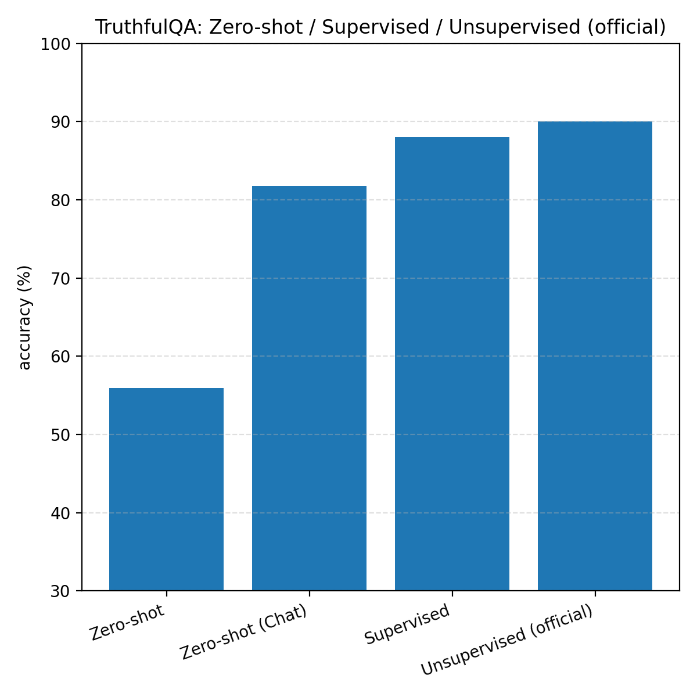
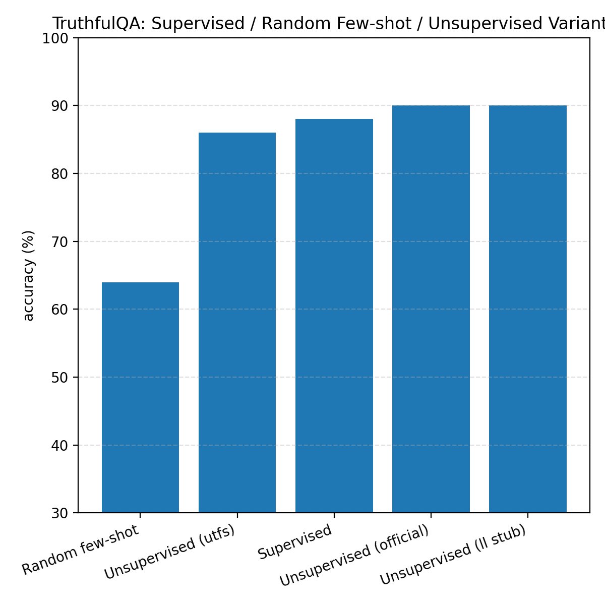
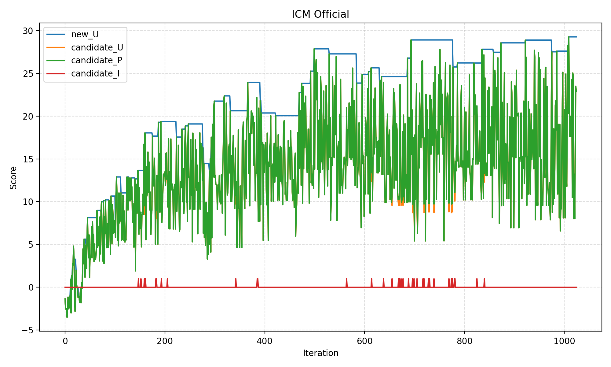
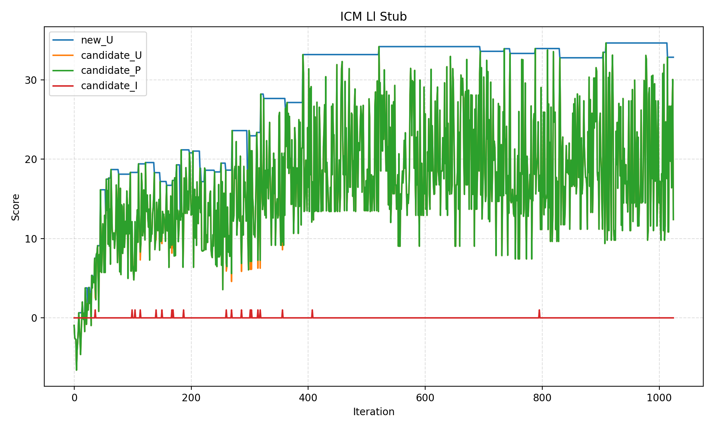
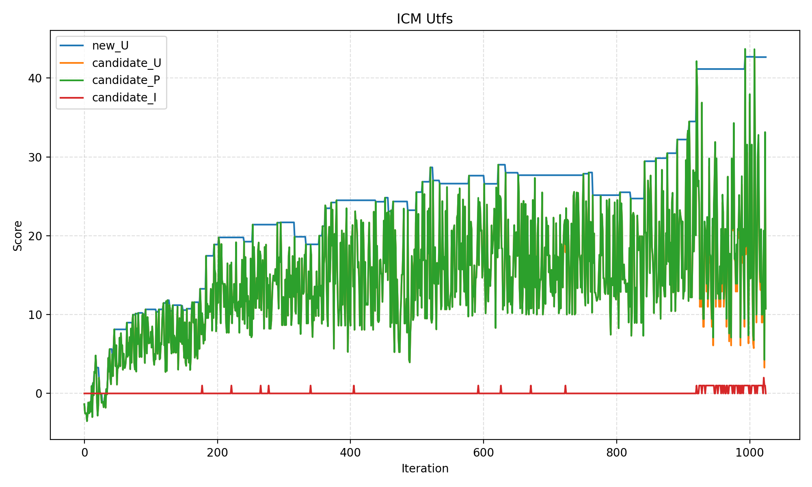

# ICM-tools: Unsupervised Elicitation Replication (Phase 1 Project)

This repository implements **Internal Coherence Maximization (ICM)** from  
*Unsupervised Elicitation of Language Models* (Wen et al., 2025), and reproduces the TruthfulQA results required for Praxis Sprint UE1.

It provides:

- A full ICM search implementation  
- Evaluation pipelines for all baseline and unsupervised settings  
- Automatic figure generation  
- A unified CLI entry (`main.py`)  

Once configured, **the entire workflow—evaluation, ICM search, and plotting—runs with a single command**:

```
python main.py
```

---

# 1. Repository Structure

```
ICM-tools/
│
├── main.py
├── icm/                       # Internal Coherence Maximization implementation
├── eval/                      # Evaluation + plotting
├── utils/
│
├── truthfulqa_train.json
├── truthfulqa_test.json
│
├── report/                    # Curated Phase 1 deliverable figures
│   ├── truthfulqa_main_settings_bar.png
│   ├── truthfulqa_unsup_variants_bar.png
│   ├── attempt_20251211_112742_official_ud.png
│   ├── attempt_20251211_112742_ll_stub_ud.png
│   └── attempt_20251211_112742_utfs_ud.png
│
├── results/                   # Auto-created experiment logs
├── ICM.sqlite3                # Optional caching DB (auto-created if missing)
│
├── README.md
```

---

# 2. Installation

### Requirements
Python **3.10+** recommended.

Install dependencies:

```
pip install -r requirements.txt
```

### API Key
Set your Hyperbolic API key:

```
export HYPERBOLIC_API_KEY="your_key_here"
```

Loaded automatically via:

```python
from utils.env import get_env_api_key
```

---

# 3. Running the Full Pipeline

To run everything:

```
python main.py
```

This performs:

1. Evaluation under 5 settings  
2. Optional ICM search (enable via `--do-icm`)  
3. Plot generation  
4. Saving all output files to a timestamped attempt folder:

```
results/attempt_{YYYYMMDD_HHMMSS}/
    evaluation/
    icm/
    output.txt
```

---

# 4. Evaluation Settings

### Run specific modes
```
python main.py --eval-settings zero_shot,unsupervised
```

### Disable evaluation
```
python main.py --no-eval
```

### Custom dataset paths
```
python main.py --train-path ... --test-path ...
```

### Random few-shot K
```
python main.py --random-fewshot-k 8
```

---

# 5. Unsupervised Evaluation (Three MP Methods)

The unsupervised few-shot evaluation is run with all three Mutual Predictability (MP) methods:

| Method | Description |
|--------|-------------|
| **official** | Faithful scoring using averaged logprob across full context |
| **ll_stub** | Approximate scoring, significantly faster |
| **utfs** | Uniform token-frequency stub; diagnostic baseline |

Generated files follow the pattern:

```
unsupervised_official_truthfulqa.json
unsupervised_official_truthfulqa_arguments.json
unsupervised_official_truthfulqa_summary.json

unsupervised_ll_stub_truthfulqa.json
...
unsupervised_utfs_truthfulqa.json
...
```

A combined plot is produced:

```
evaluation/truthfulqa_unsup_variants_bar.png
```

---

# 6. ICM Search

Enable with:

```
python main.py --do-icm
```

Outputs are saved under:

```
results/attempt_{timestamp}/icm/
    official/
        target_subset.json
        ud.json
        icm_arguments.json
        attempt_*_official_ud.png
        
    ll_stub/
        target_subset.json
        ud.json
        icm_arguments.json
        attempt_*_ll_stub_ud.png
        
    utfs/
        target_subset.json
        ud.json
        icm_arguments.json
        attempt_*_utfs_ud.png
```

Each MP method has its own directory.

---

# 7. Default ICM Hyperparameters (This Implementation)

This repository uses the updated default hyperparameters:

### Scoring & Subset
| Flag | Default | Meaning |
|------|----------|---------|
| `--icm-alpha` | **1.0** | Weight in `U(D) = α·P(D) - I(D)` |
| `--icm-target-subset-size` | **8** | Target subset K |
| `--icm-max-iter` | **1024 (256×4)** | Max simulated annealing iterations |

### Consistency
| Flag | Default | Meaning |
|------|----------|---------|
| `--icm-consistency-mode` | **at_most_one_true** | Logical consistency |
| `--icm-enforce-unique-cid` | `False` | Hard uniqueness (optional) |

### Temperature Schedule
| Flag | Default | Meaning |
|------|----------|---------|
| `--icm-initial-t` | **10** | Initial temperature |
| `--icm-final-t` | **0.01** | Final temperature |
| `--icm-decay` | **0.99** | Decay factor |
| `--icm-scheduler` | **log** | “log” or “exp” |

### Concurrency
| Flag | Default |
|------|----------|
| `--icm-max-concurrent` | **4** |

---

# 8. Generated Figures (Phase 1 Deliverables)

### Main settings comparison  
Located in the evaluation folder:

```
evaluation/truthfulqa_main_settings_bar.png
```



---

### Unsupervised MP method comparison  
```
evaluation/truthfulqa_unsup_variants_bar.png
```



---

### ICM U(D) diagnostics  
Produced per MP method under `icm/official`, `icm/ll_stub`, `icm/utfs`.

Example:







---

# 9. Actual Attempt Folder Structure (Corrected to Match Implementation)

Each run produces **exactly this structure**:

```
results/attempt_{timestamp}/
│
├── evaluation/
│   ├── zero_shot_truthfulqa.json
│   ├── zero_shot_truthfulqa_arguments.json
│   ├── zero_shot_truthfulqa_summary.json
│   ├── zero_shot_chat_truthfulqa.json
│   ├── zero_shot_chat_truthfulqa_arguments.json
│   ├── zero_shot_chat_truthfulqa_summary.json
│   ├── supervised_truthfulqa.json
│   ├── supervised_truthfulqa_arguments.json
│   ├── supervised_truthfulqa_summary.json
│   ├── random_few_shot_truthfulqa.json
│   ├── random_few_shot_truthfulqa_arguments.json
│   ├── random_few_shot_truthfulqa_summary.json
│   ├── unsupervised_official_truthfulqa.json
│   ├── unsupervised_official_truthfulqa_arguments.json
│   ├── unsupervised_official_truthfulqa_summary.json
│   ├── unsupervised_ll_stub_truthfulqa.json
│   ├── unsupervised_ll_stub_truthfulqa_arguments.json
│   ├── unsupervised_ll_stub_truthfulqa_summary.json
│   ├── unsupervised_utfs_truthfulqa.json
│   ├── unsupervised_utfs_truthfulqa_arguments.json
│   ├── unsupervised_utfs_truthfulqa_summary.json
│   ├── truthfulqa_main_settings_bar.png
│   └── truthfulqa_unsup_variants_bar.png
│
├── icm/
│   ├── official/
│   │   ├── target_subset.json
│   │   ├── ud.json
│   │   ├── icm_arguments.json
│   │   └── attempt_*_official_ud.png
│   │
│   ├── ll_stub/
│   │   ├── target_subset.json
│   │   ├── ud.json
│   │   ├── icm_arguments.json
│   │   └── attempt_*_ll_stub_ud.png
│   │
│   └── utfs/
│       ├── target_subset.json
│       ├── ud.json
│       ├── icm_arguments.json
│       └── attempt_*_utfs_ud.png
│
└── output.txt
```

This is the **exact structure produced by your current code**, and should be used in all documentation.

---

# 10. Reproducing Figures

```
python main.py
```

or re-plot from an existing run:

```
python eval/plot_truthfulqa_eval.py --attempt results/attempt_YYYYMMDD_HHMMSS
```

---

# 11. ICM.sqlite3 Cache (Optional, Auto-Created)

This project supports a large caching database (`ICM.sqlite3`) which stores:

- logprob queries  
- completions  
- MP computations  
- intermediate ICM scoring results  

### Benefits
- dramatically speeds up repeated runs  
- reduces API calls  
- mitigates rate limits (429)  

### Obtaining the full cache
A pre-computed cache (~15 GB) is available upon request:

**Email:**  
`usingnamespacestc@gmail.com`

### Automatic creation
If the file does **not** exist, it will:

- be created automatically  
- fill incrementally during runtime  
- accelerate all future executions  

---

# 12. Phase 1 Submission Checklist

This repository now includes:

- Full ICM implementation  
- Complete evaluation pipeline  
- All required figures under `report/`  
- Correct documentation of default hyperparameters  
- Reproducible attempt folder outputs  
- Optional caching support  

This README is ready for **Praxis Sprint UE1** submission.

